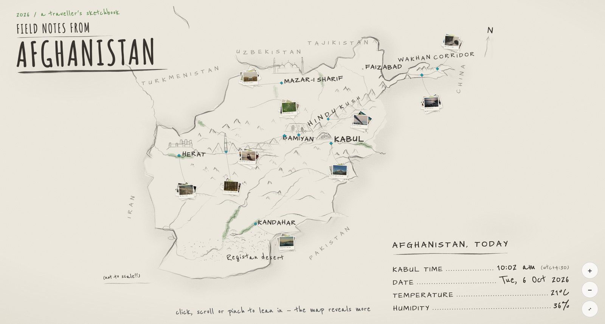
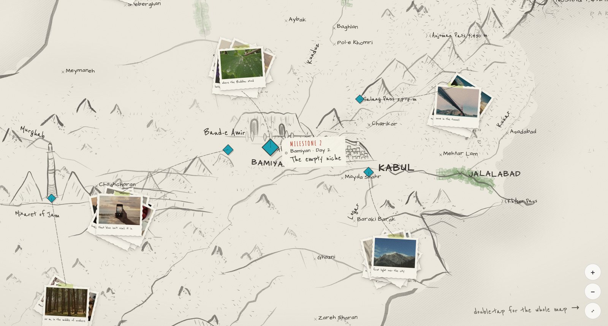

# Field Notes from Afghanistan

A travel diary as a **hand-drawn, zoomable map**: Afghanistan sketched in pencil like a traveller's notebook,
with the trip's photos pinned to the places they were taken and a live "I was here!" note that follows the journey.



The sketch is **generated from real geography**, not drawn by hand: borders, rivers and elevation data are pushed
through a set of pencil-stroke primitives (pressure, wobble, re-traced lines, hatching, smudges), so it looks hand-made
but every place sits where it really is.



## What's on the page

- **An opening that draws itself.** The border is traced in, then the rivers and mountains, then the names, letter by
  letter. The photo stacks drop in last.
- **Two-state zoom: the whole map ↔ 3×.** Leaning in reveals more: relief hatching, towns and passes, oasis fields
  along the rivers, and the Wakhan Corridor in detail.
  - **To zoom in:** click (the cursor is a pencil magnifier), scroll or pinch.
  - **To zoom out:** double-tap, Esc, or the buttons.
- **Photo stops.** A turquoise diamond marks each place, numbered as milestones in trip order.
  - **Hover a stop:** a paper tag shows the place, the day and a title.
  - **Click a stop:** the stack of deckle-edged prints spreads out. Click a print to hold it up close, and use ← / → to flip through.
- **"I was here!"** A red pencil arrow and note point at the latest check-in. The open page picks up a new check-in within 30 seconds.
- **"Afghanistan, today."** A hand-lettered legend showing Kabul time, the date, temperature and humidity (from Open-Meteo).
- **Hand-drawn landmarks.** The Bamiyan cliff and its empty niches, the Minaret of Jam, the Herat citadel, Kabul's
  walled hills, the Blue Mosque, Band-e Amir, and a Marco Polo sheep skull in the Pamirs.

## Run it locally

Requires Node 18 or newer. Rebuilding the map also needs Python 3 with Pillow.

```bash
npm install
npm run dev          # http://localhost:5174/  (map)   ·   http://localhost:5174/checkin/  (check-in page)
npm test             # coordinate round-trip + check-in guardrail tests
```

`npm run dev` serves the site and a **local stand-in for the check-in receiver**. It is reachable from this computer only.

The map tiles in `tiles/` are pre-built. After changing anything under `js/map/`, rebuild them:

```bash
npm run build:tiles  # draw every zoom tier → slice into WebP tiles (~40 s)
npm run build:data   # optional: re-derive borders/rivers + elevation from the sources (downloads ~100 MB)
```

## How it works

```
Natural Earth + elevation grid
        │  tools/build-map-data.py, build-elevation.py
        ▼
data/*.json ──► js/map/geo.js         one projection + a small "drawn from memory" warp (pins share it)
        │      js/map/pencil.js       stroke primitives: pressure brush, rough lines, peaks, hatching
        │      js/map/sketch-map.js   every layer: border, rivers, mountains, landmarks, labels…
        ▼  tools/build-tiles.mjs (resvg) + slice-tiles.py
tiles/<tier>/<z>/<x>/<y>.webp   +  tiles/map.json (labels)  +  tiles/intro/* (opening plates)
        ▼
index.html + js/site.js   Leaflet (CRS.Simple), live hand-lettered labels, zoom tiers, opening, photos, check-in
```

| Path | What it is |
|---|---|
| `index.html`, `js/site.js` | The site: page markup and styles, and all page logic |
| `js/map/` | Drawing (`sketch-map.js`, `pencil.js`, `wakhan.js`, `relief.js`), coordinates (`geo.js`), zoom tiers (`tiers.js`), opening (`opening.js`), photo stops (`photos.js`), check-in note (`checkin-pin.js`), today legend (`almanac.js`) |
| `data/photos.json` | The photo stops: place, coordinates, day, title, photos (placeholders for now) |
| `checkin/` | The private check-in page (place name, coordinates or a Google Maps link → pin → submit) |
| `js/checkin/core.js` | Check-in rules and guardrails, shared by every receiver |
| `tools/` | Data and tile builders, and the local dev server |
| `docs/` | Plans: hosting, zoom, pin-drop. `research/` has the geography notes |
| `spike/` | Experiments and the style bench (`spike/map-lab.html` renders the drawing live) |

## Check-ins and privacy

Check-ins are sent from a small private page and stored as plain JSON files, with no database. Only a **public
summary** ever leaves private storage (`publicView()` in `js/checkin/core.js`):
- **Whitelisted fields only:** the date (day only), the position, the place name and the note.
- **Town-level by default:** the position is snapped to the town unless you choose exact, province or hidden.
- **A kill switch** hides check-ins entirely.

Photos should have their EXIF/GPS data stripped before publishing. Each stop sets its own precision (`exact`, `approx` or `hidden`).

The deployment plan (Cloudflare Pages + R2 for photos, plus a tiny Worker behind Cloudflare Access for check-ins) is
in [`docs/hosting-plan.md`](docs/hosting-plan.md).

## Security

- **Content-Security-Policy** on both pages, and no inline scripts.
- **Leaflet is integrity-checked** (SRI) when it loads from the CDN.
- **Data is never treated as markup:** everything from `photos.json`, the labels and check-ins is escaped or inserted as text.
- **Photo URLs are allow-listed** (https or relative only).
- **The local dev server:**
  - binds to 127.0.0.1 and checks the `Host` header (against DNS rebinding);
  - rejects cross-site requests;
  - blocks path traversal and dotfiles;
  - sends `nosniff` and frame-deny headers.

## Data and credits

- Borders, rivers and lakes: [Natural Earth](https://www.naturalearthdata.com/) (public domain).
  Some tributaries are hand-traced and approximate.
- Elevation: [AWS Terrain Tiles](https://registry.opendata.aws/terrain-tiles/) (Mapzen; SRTM, GMTED and other sources).
- Weather: [Open-Meteo](https://open-meteo.com/) (CC BY 4.0).
- Check-in place search: [Nominatim](https://nominatim.org/) / © [OpenStreetMap](https://www.openstreetmap.org/copyright)
  contributors (ODbL). Check-in preview tiles © Esri.
- Map viewer: [Leaflet](https://leafletjs.com/). Tile rendering: [resvg](https://github.com/RazrFalcon/resvg).
- Fonts: Architects Daughter, Reenie Beanie, Amatic SC and Inter ([Google Fonts](https://fonts.google.com/), OFL).
- Placeholder photos: [Lorem Picsum](https://picsum.photos/). These will be replaced by the real trip photos.

---

Built with [Claude Code](https://claude.com/claude-code).
